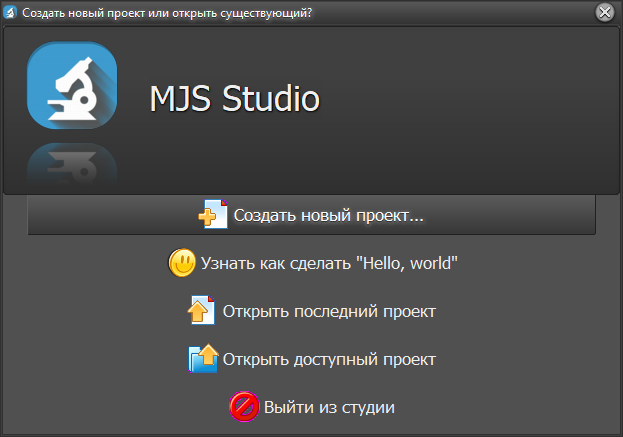
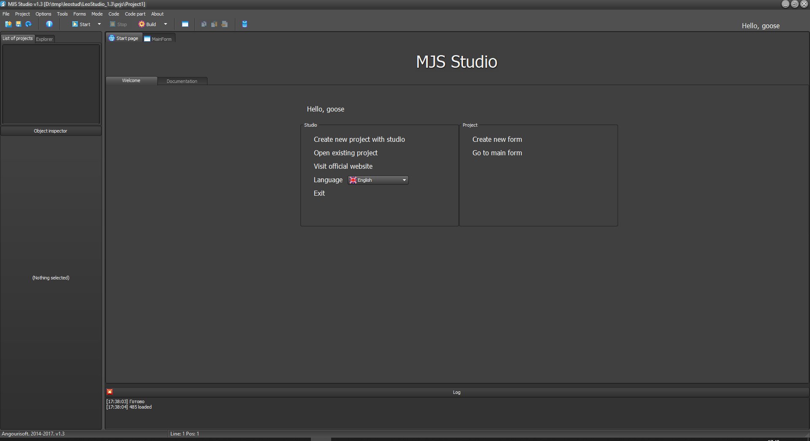
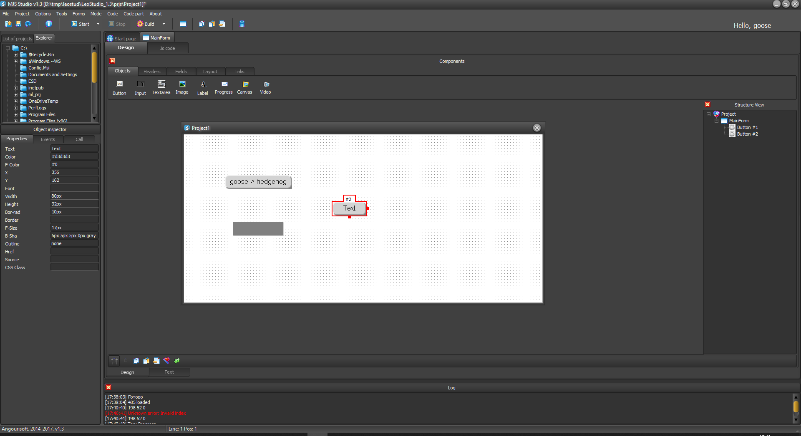
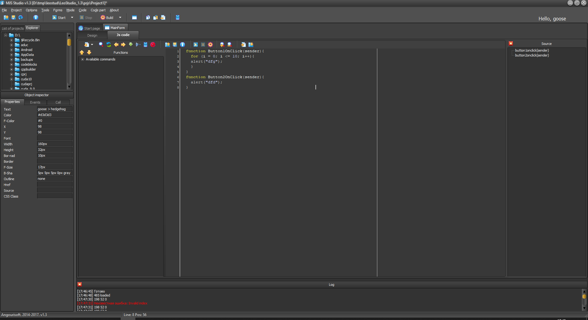

# Leo Studio
My project from 2016 of little me

It's a delphi-style IDE for developing desktop apps. Your only programming language here is JS, but you can set style with CSS.

## Programming process (screenshots)

### Start menu

### Start page

### Delphi-style developing

### Coding environment

